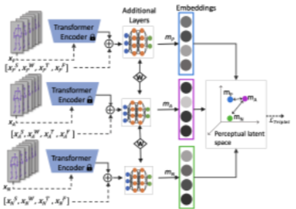

# motion-similarity
A Python project for learning a perceptually-accurate latent space for motion synthesis wherein geometric distance is monotic with dissimilarity ratings between inputs. This project trains models on motion capture data as well as data gathered from user studies. It employs an adaptation of the triplet network via a custom loss over user study data; this permits us to begin learning a perceptual similarity metric over human motion.  

Final proposed network architecture is as follows: 

[](./images/final_architecture.png)

See the original motivating paper [here](https://drive.google.com/file/d/1x_s68q_QcSxHmW7XdQGjGIGRS34B5cop/view).

All motion data is stored as .bvh files; read about the .bvh format [here](https://research.cs.wisc.edu/graphics/Courses/cs-838-1999/Jeff/BVH.html)

## On LMA
Part of the features inputted into our similarity network represent style information. This information is produced by our CNN and comprises the Effort category of Laban Movement Analysis (LMA). LMA is a technique created by Rudolf Laban to formally describe human movement. It is used in a broad range of fields such as dance, physical therapy, drama, psychology, and anthropology. LMA comprises four categories: Body, Effort, Shape, and Space. LMA terms are capitalized.  

**Body** defines the structural aspects of the human body during motion, i.e., what the body is doing and the relationship of the body parts during motion. 

**Effort** is the dynamic component, which is used to describe the characteristics of movement based on humans’ inner attitudes. 

**Shape** determines the way these attitudes are expressed through the body, and it is manifested in postures. 

**Space** describes how a person connects to their environment; locale, directions, and paths of a movement, and it is partly related to steering. 

PERFORM keeps Body and Space fixed and focuses on Shape and Effort components. In fact, it considers Shape regarding its relationship to Effort. So, it wouldn’t be wrong to conclude that we are only focusing on Effort as the dynamic component of LMA in our work.

### On Effort
Effort is described through four motion factors, where each factor is a continuum between bipolar Effort elements: indulging and condensing and can be represented as ranging from -1 to +1. The Effort elements are Space (Indirect vs. Direct), Weight (Light vs. Strong), Time (Sustained vs. Sudden), and Flow (Bound vs. Free).

Each effort element is characterized by certain trait-descriptive adjectives as:

Indirect: Flexible, meandering, multi-focus
Direct: Single-focus, channeled, undeviating 
Light: Buoyant, delicate 
Strong: Powerful, having an impact 
Sustained: Lingering, leisurely, indulging in time 
Sudden: Hurried, urgent 
Free: Uncontrolled, abandoned, unlimited 
Bound: Careful, controlled, restrained Human beings exhibit a variety of Effort combinations. 

The Efforts are on a continuum between two ends:  
Indirect (-)<--> Direct (+)   
Light (-) <--> Strong (+)  
Sustained (-) <--> Sudden (+)  
Free (-) <--> Bound (+)  

Single Effort elements and combinations of all four Efforts are highly unlikely, and they appear only in extreme cases. In our daily lives, we tend to use Effort in combinations of 2 (States) or 3 (Drives). States are more ordinary and common in everyday usage, whereas Drives are reserved for extraordinary moments in life. We have more intense feelings in these distinctive moments, therefore, they convey more information about our personality. With the ultimate goal of developing personality-driven motion synthesis, we focused on States and Drives when designing our user study. Participants were shown a screen of three humanoid mannequins expressing the same action in parallel, but under different effort parameterizations. Participants were tasked with selecting the two motion sequences out of three that they felt were most similar. We focus on States and Drives, plus the neutral expression, in order to systematize the selection of triplets.

### Conda Environment
To install dependencies, cd into the root directory of motion-similarity and create a conda environment from the provided yaml file:
```
$ conda env create -f motion_similarity_env.yml
```
The first line of the yml file sets the new environment's name.
Activate your conda environment by name:
```
$ conda activate motion-similarity
```

### Execute
run the project from the root directory with `python main.py`.

### Reproducing the model sweep
For the full per-model training, embedding-extraction, and evaluation sweep behind the
paper's results (all nine encoders, both raw embeddings and triplet-refined, across walking,
pointing, and picking) — including exact checkpoints, encode commands, environment knobs,
and the geometric baselines — see [docs/REPRODUCING_SWEEP.md](docs/REPRODUCING_SWEEP.md).
The working manuscript draft is at [docs/paper_draft.md](docs/paper_draft.md).

---

## Project organization — model map and phases

The work is organized into two phases: (1) the **self-supervised encoder comparison** (our
nine encoders, the headline + ablation results), and (2) the **learned-baseline comparison**
(against TMR, a purpose-built learned motion-similarity metric). Large model checkpoints and
data live on the compute cluster (chimera) under the `triplets/` scratch root, not in this repo.

### Phase 1 — self-supervised encoders (logical map)

These models are already trained and the paper's §4/§6 results depend on their exact checkpoint
paths (referenced in `cv_preliminary.ENCODERS`). They are documented here as a **logical map**;
the physical directories are intentionally **not reorganized**, to preserve reproducibility of
the finalized results.

| Logical role | Encoder(s) | Checkpoint location (chimera `triplets/`) |
|---|---|---|
| Plain-transformer AE (velocity factorial) | `vanilla-rot1vel0` / `rot1vel1` / `rot0vel1` | `checkpoints/v3_ablation_rot1_vel0` … |
| MLD SkipTransformer AE (velocity factorial) | `MLD-AE-holdout` / `MLD-AE-vel` / `AE-velonly` | `checkpoints_ae_mld/v0_ae_3ds_seed0_traj` … |
| MLD variational AE | `MLD-VAE-holdout` | `checkpoints_vae_mld/v0_mld_holdout_seed0_3ds` |
| Masked-motion specialist | `MAMP` (motion-only) | `MAMP/output_dir/lma_mamp_holdout_1200` |
| **Headline encoder** | `MAMP+pose` | `MAMP/output_dir/lma_mamp_pose_holdout` |
| TMR-corpus-matched encoder | `MAMP+pose` (cut1 corpus) | `MAMP/output_dir/lma_mamp_pose_holdout_cut1` |

### Phase 2 — learned-baseline (TMR) comparison

This phase **is** physically organized (built fresh), under `triplets/learned_baselines/`:

```
learned_baselines/
├── bvh2tmr_pipeline/        # convert our CMU-33 BVH motions into TMR-ready inputs
│   ├── joints2smpl/         #   SMPLify fitter (BVH joints -> SMPL params)
│   ├── tmr_guofeats/        #   SMPL/joints -> HumanML3D 263-d Guo features
│   ├── scaled/              #   the 171 canonical clips: joints_in/ fit_out/ feats263/
│   └── scripts/             #   bvh_to_smpl22, fitted_to_263, validate_fit, visual_check, …
└── tmr/
    ├── repo/                # TMR source (Petrovich et al., ICCV 2023)
    ├── models/              # pretrained tmr_humanml3d_guoh3dfeats (encoder + Mean/Std)
    └── encoded/             # TMR embeddings of our 171 clips
```

The pipeline converts our motions to the exact feature space TMR's encoder consumes
(BVH → SMPL params via joints2smpl → HumanML3D 263-d features), enabling a like-for-like
comparison: our corpus-matched encoder vs. the real released TMR, evaluated against `d_perc`
on the identical held-out folds as the geometric baselines.

## External assets (not committed — obtain separately)

Several inputs are large, externally hosted, or license-gated, so they are **not** stored in
this repository. To reproduce, obtain and place them as follows:

| Asset | Where to obtain | Place at |
|---|---|---|
| **SMPL body models** (`SMPL_{NEUTRAL,MALE,FEMALE}.pkl`) | [smpl.is.tue.mpg.de](https://smpl.is.tue.mpg.de) / [smplify.is.tue.mpg.de](https://smplify.is.tue.mpg.de) (registration required) | `learned_baselines/bvh2tmr_pipeline/joints2smpl/body_models/smpl/` |
| **TMR pretrained model** | `bash prepare/download_pretrain_models.sh` in the [TMR repo](https://github.com/Mathux/TMR) (gdown; verify `md5sum tmr_models.tgz == 7b6d8814f9c1ca972f62852ebb6c7a6f`) | `learned_baselines/tmr/models/` |
| **joints2smpl fitter** | `visualize/joints2smpl/` subdir of the [MDM repo](https://github.com/GuyTevet/motion-diffusion-model) | `learned_baselines/bvh2tmr_pipeline/joints2smpl/` |
| **TMR `guofeats` extractor + Mean/Std** | bundled in the [TMR repo](https://github.com/Mathux/TMR) (`src/guofeats/`, `stats/humanml3d/guoh3dfeats/{mean,std}.pt`) | with the staged TMR repo |
| **`cut1_hml3d_spirit` corpus** (TMR-budget-matched pretraining set) | rebuild via `scripts/build_cut1_symlinks.py` (sources — AMASS subsets + CMU — already on chimera; symlink farm only) | `cut1_hml3d_spirit/` (or chimera mirror) |

> **Conda environments** used across phases (not committed; recreate as needed):
> `torch_gpu_cu12` (main repo / training), `j2s` (joints2smpl: smplx 0.1.28 + patched chumpy
> 0.70 for numpy ≥ 1.24, scipy, PyGLM), and `tmr` (pytorch_lightning, hydra-core, einops,
> orjson). Phase-specific setup notes live with each phase's scripts.


